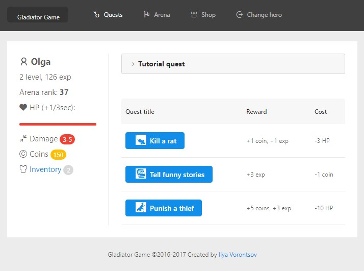

# gladiator 

Experimental game project based on *React* and *antd*.

## Setup and run

Setup all dependencies: `npm install`.

Then run: `npm start`.

Open: `http://localhost:3333`

Enjoy!

## Milestones and future plans

*Game features:*

* Quest chains and narrative design
* Craft and loot system
* Special weapon and armor available for arena rank points

*Tech stack improvements:*

* Move dev-platform to `create-react-app` environment
* Use `MongoDB` as a data storage
* Move project to full-stack rails with `Node.js` and `RESTFul`
* Add unit-test tools and write some tests

## Changelog

#### v.0.2.2 (19.07.2017)

Improve reward system:

 * items as a reward
 * probability based on %-values

#### v.0.2.1 (18.07.2017)
 
 Remove `mobx` and use `Redux` instead

#### v.0.2 (01.06.2017)
 
 Release arena battle mechanic :hocho:

#### v.0.1.1 (03.05.2017)
 
 Add `mobx` support (store application state)

#### v.0.1 (06.04.2017)
 
 Remove `bootstrap` and use `antd` instead

#### v.0.0.1 (05.07.2016)
 
 Birthday :tada: